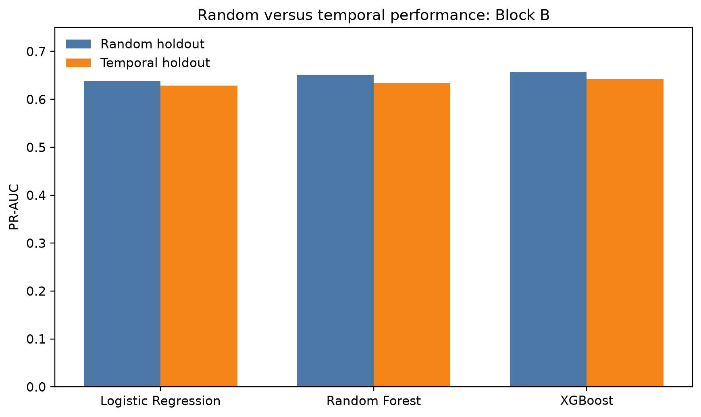
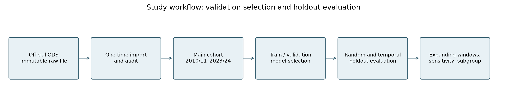

# England Non-Domestic Fire Spread ML

**How much does a random train–test split change estimated fire-spread prediction performance?** This study compares random and temporal evaluation on completed England Fire and Rescue Service incident records, with explicit checks of feature timing, outcome-proxy sensitivity and simple baselines.

The repository contains reproducible Python code, fitted models, per-record test predictions, uncertainty estimates and a generated [analysis report](reports/final_analysis_report.md). All published results were rebuilt in the current run; the [execution record](outputs/metrics/execution.json) documents its stages and code/configuration hashes.

This is a retrospective prediction study. Its results do not establish real-time deployment readiness, causal effects or a building's annual ignition risk. The official **Other Building Fires** category includes commercial, industrial, public and institutional premises, and some accommodation such as hotels and care homes.

## Results at a glance

The main cohort contains **209,171 incidents** from **2010/11–2023/24**, with **53,804 larger fires (25.7%)**. Average precision (AP) is the primary metric; higher is better, and the no-information baseline is the positive prevalence.

| Experiment | Random test AP | Temporal test AP |
|---|---:|---:|
| Full Block B, validation-selected XGBoost | 0.6566 | 0.6402 |
| Block B without `OCCUPIED_TIME`, same XGBoost settings | 0.6523 | 0.6387 |
| `BUILDING_TYPE` only, logistic regression | — | 0.5173 |
| `FIRE_SIZE_ON_ARRIVAL` only, logistic regression | — | 0.9627 |
| Full Block C, validation-selected XGBoost | 0.9739 | 0.9821 |

The full-Block-B random-minus-temporal AP difference is **+0.0164**, with a 95% fixed-model bootstrap interval of **[+0.0013, +0.0316]**. This quantifies the selected models on these splits; it is not a universal estimate of optimism from random splitting. AP comparisons also depend on prevalence. ROC-AUC, Brier score, prevalence context and 20 random split assignments are reported separately.

Without `OCCUPIED_TIME`, the split difference is **+0.0136 [-0.0017, +0.0285]**. Its point estimate remains positive, but the interval includes zero: evidence for a positive gap is less conclusive under this reduced-feature specification. This is not evidence that the two gaps differ significantly; no joint difference-of-differences interval was estimated.

[](outputs/figures/03_random_vs_temporal_pr_auc.png)

*Figure 1. The same modelling families are evaluated under both designs. Hyperparameters and analytical F1 thresholds are selected using validation data; test scores do not choose the winner. Click any figure to view full size.*

[](outputs/figures/11_occupancy_ablation.png)

*Figure 2. Removing `OCCUPIED_TIME` changes AP by -0.0044 on the random holdout and -0.0015 on the temporal holdout. The right panel shows paired differences on identical test records (without occupancy minus full B). The field may include occupants in buildings reached by spread, so this measures sensitivity to a potential outcome proxy; it neither proves nor rules out leakage. Other fields can carry related information.*

[](outputs/figures/12_simple_baselines.png)

*Figure 3. Simple baselines make the information content of building type and arrival fire size visible. Differences are single-field baseline minus full reference. These comparisons change both information and model family, so they do not isolate effects of additional features. High arrival-state AP does not show that the full Block C information was available when crews arrived.*

The four diagnostic fits were specified after reviewing the study and use previously examined test periods. Their 10,000-repeat intervals condition on fitted models and observed class counts, with paired resampling for same-test comparisons and partially paired resampling for overlapping random/temporal holdouts. They omit retraining and model-selection uncertainty and are exploratory, without multiplicity adjustment. The main Block B interval uses 100,000 repeats under the same fixed-model interpretation.

## Study design

[](outputs/figures/01_study_workflow.png)

*Figure 4. Source import, cohort construction, validation-based model selection, holdout evaluation and sensitivity analysis. The temporal partition is shown below; the stratified random comparator uses exactly the same partition sizes.*

| Temporal partition | Financial years | Incidents |
|---|---|---:|
| Training | 2010/11–2019/20 | 159,533 |
| Validation | 2020/21–2021/22 | 23,824 |
| Test | 2022/23–2023/24 | 25,814 |

- **Outcome:** `LARGER_FIRE`, mapped explicitly from `SPREAD_OF_FIRE`. The main cohort removes exact duplicates and late calls, excludes roof/roof-space and predefined unknown/missing target categories, and retains the room→floor→whole-building ordering. Unrecognised labels fail validation. A roof-positive sensitivity tests the alternative published convention.
- **Models:** prior-probability Dummy, Logistic Regression, Random Forest and XGBoost. Compact candidate grids are searched using Block B validation AP. Preprocessing fits training data only. Models remain train-fitted when their validation-F1 thresholds are applied to test data.
- **Block A:** structural and context fields. **Block B:** retrospective incident fields, including investigation information and estimated delay. **Block C:** Block B plus arrival-state fields. B is not a strictly dispatch-time model, and C is not a verified arrival-time model.
- **Diagnostics:** remove `OCCUPIED_TIME` from B under both designs with the selected XGBoost parameters fixed; fit two temporal single-field logistic baselines with fixed `C=1.0`.
- **Robustness:** alternative outcome/cohort definitions, later-year evaluation, annual expanding windows and 20 random split assignments. Annual 2020/21–2021/22 results are descriptive because these years also inform model selection; they are not independent test folds.
- **Interpretation:** grouped permutation importance measures dependence of the fitted temporal Block B model on original fields, not causal effects. AP is scikit-learn's non-interpolated `average_precision_score`; legacy `pr_auc` file/column names store this metric.

No external GIS, weather, demographic or commercial-building data are used. Operational deployment would require verified feature availability, a defined decision and its costs, and prospective or independently held-out evaluation.

## Reproduce the analysis

Use **Python 3.12** and the dependencies pinned in [pyproject.toml](pyproject.toml). The recorded run uses an NVIDIA GPU and XGBoost `device=cuda`; actual fitted CUDA execution is checked. Logistic regression convergence warnings fail the run rather than silently accepting an unconverged model.

```powershell
py -3.12 -m venv .venv
.\.venv\Scripts\Activate.ps1
python -m pip install -e ".[test]"
```

Obtain the [official source ODS](https://assets.publishing.service.gov.uk/media/6a5e7a52c7c34404041b4663/Other_building_fires_dataset.ods) and place it at `data/raw/Other_building_fires_dataset.ods`. Acquisition does not download it automatically. The expected source SHA-256 is:

```text
560e5c1a18731cf8189b28471f6813675d6f95f447d680ec5603d9bb97718595
```

The ODS and two derived Parquet data files are excluded from Git. First import can require substantial RAM because the ODS parser loads its worksheets in memory; later runs use the Parquet cache. This run's exact source and derived-file hashes are in the [data manifest](outputs/metrics/data_archive_manifest.json). The publisher URL can change: retain or archive the matching ODS and both Parquet files separately. A checksum verifies retained bytes but does not make the data downloadable from this repository.

```powershell
# Full rebuild: replaces outputs/ and regenerates all models, diagnostics and reports.
python scripts/06_build_report.py --clean

# Render saved results only; no acquisition, fitting or bootstrap.
python scripts/07_render_report.py
```

The full run records stage completion, input code/config hashes and errors in `outputs/metrics/execution.json`. Source, training, diagnostic and rendering provenance are recorded separately. Rendering reads saved predictions and tables and regenerates summaries/figures; it does not overwrite training receipts. A clean checkout can render committed results without external data or CUDA.

For a partial workflow, scripts `01`–`05` expose acquisition, audit, cohort, model and robustness stages. `08_run_review_experiments.py` adds the four diagnostics to an already complete matching core analysis; `--fit-only`, `--uncertainty-only` and `--resume` separate verified fitting from interval calculation. Its completed fits are protected against accidental overwrite. The complete `06` command handles the correct order automatically.

The complete diagnostic protocol requires CUDA and the source ODS for checksum verification. CPU experiments would require explicitly revising the protocol and recording a new run; matching software and hardware still does not promise bit-for-bit model reproduction.

## Validation and outputs

```powershell
python -m pytest -q                 # Synthetic unit tests; no research data or GPU
python -m pytest -q -m artifact     # Consistency of committed results
python -m pytest -q -m integration  # Exact local source and Parquet data required
```

CI runs the synthetic suite and checks that it does not modify research artifacts. Tests cover target mapping, feature exclusion, split integrity, prediction alignment, exact bootstrap calculations, training boundaries, rendering and clean-run failure handling.

The published run passed **109 synthetic tests, 32 artifact checks and 2 real-data integration checks**.

| Location | Contents |
|---|---|
| [Final analysis report](reports/final_analysis_report.md) | Findings, uncertainty, diagnostics and limitations |
| [Methods receipt](reports/methods_receipt.md) | Source, cohort, features, settings, software and output manifest |
| [Hyperparameter plan](reports/hyperparameter_plan.md) | Candidate configurations and validation performance |
| [outputs/tables](outputs/tables) | Audit, split assignments, performance and robustness tables |
| [outputs/figures](outputs/figures) | Twelve figures, each in PNG and PDF |
| [outputs/diagnostics](outputs/diagnostics) | Four diagnostic models, validation/test predictions, intervals and receipts |
| [outputs/metrics](outputs/metrics) | Main predictions, execution, model selection and environment records |
| [outputs/models](outputs/models) | Validation-selected fitted pipelines |

Source definitions and quality notes: [government dataset entry page](https://www.gov.uk/government/statistics/fire-statistics-incident-level-datasets) and [Other Building Fires guidance](https://www.gov.uk/government/statistics/fire-statistics-incident-level-datasets/other-building-fires-dataset-guidance).
