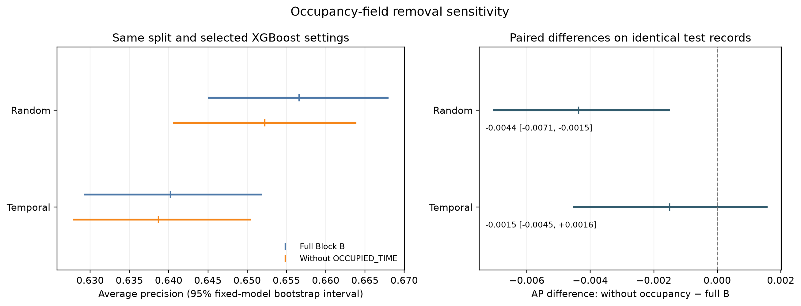
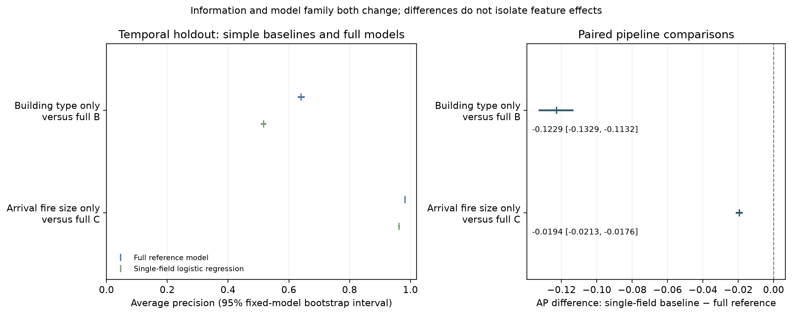

# Final analysis report

## Study definition

This retrospective prediction study uses the official **Other Building Fires Dataset** for England. “Non-domestic building fires” is the study's analytical wording for the official *other building fires* category. The category includes commercial, industrial, public and institutional buildings and can include hotels, hostels, care homes and student halls; it is not limited to buildings without accommodation functions.

The analysis predicts incident-level final fire spread among already-recorded primary fires. It is not a causal study, annual building fire-risk model, fire-physics simulation or real-time FRS deployment tool. Block B contains retrospectively recorded incident information; Block C combines retrospective incident information plus arrival-state information. Its inherited Block B investigation fields have not been established as available at first arrival.

The fitted predictions, evaluation tables and method receipts from this analysis run supply the results below. The training and report-rendering environments are recorded separately.

## Data and cohort

The official ODS was updated 22 July 2026. The raw-file SHA-256 is `560e5c1a18731cf8189b28471f6813675d6f95f447d680ec5603d9bb97718595`. The audit found 245,207 logical incident rows across 2010/11–2025/26. The defined main period is 2010/11–2023/24. Excluded years are 2024/25: Suffolk FRS did not submit all incidents from September 2024 to March 2025 before the data cut; 2025/26: IRS-to-FaRDaP collection transition from November 2025 may introduce a system discontinuity.

After year restriction, 20 exact duplicates, 3,063 late calls and 6,081 roof-space or otherwise unmappable target records were removed sequentially. The main cohort contains 209,171 incidents, 53,804 larger fires (25.7%).

The main target follows the unambiguous room→floor→whole-building ordering and excludes `Roofs/ Roof spaces`, which cannot be placed uniquely on that scale. Official sources are inconsistent: the current Fire statistics definitions omit roofs from the larger-fire list, while FIRE0304-linked detailed releases include them. The roof-positive sensitivity therefore tests the alternative published convention rather than treating either source as uniquely authoritative.

## Validation and modelling

Temporal train/validation/test years are 2010/11–2019/20, 2020/21–2021/22 and 2022/23–2023/24. The stratified random comparator has exactly the same 159,533/23,824/25,814 sample sizes. All imputing and encoding were pipeline-fitted on training data only. Compact hyperparameter and family selection used validation average precision (AP), calculated with scikit-learn's non-interpolated `average_precision_score`; analytical classification thresholds maximised validation F1. The selected train-fitted pipeline and its validation-derived threshold were then evaluated once on the corresponding holdout, with no train+validation refit or test-set retuning.

Random Forest and XGBoost selected identical hyperparameters under random and temporal development designs. Selected settings differed for Logistic Regression: random `{"C": 1.0}` versus temporal `{"C": 0.1}`. The primary XGBoost RQ1 contrast therefore uses the same selected configuration in both designs.

The main model comparison is Block B, the retrospective incident-information model:

| model | n | positive_count | positive_prevalence | average_precision | roc_auc | f1 | brier_score |
|---|---|---|---|---|---|---|---|
| XGBoost | 25814 | 6850 | 0.265 | 0.640 | 0.840 | 0.638 | 0.137 |
| Random Forest | 25814 | 6850 | 0.265 | 0.634 | 0.835 | 0.632 | 0.138 |
| Logistic Regression | 25814 | 6850 | 0.265 | 0.628 | 0.831 | 0.630 | 0.140 |

## Research questions

### RQ1 — Random versus temporal validation

For the validation-selected Block B XGBoost, random holdout AP was 0.657 (95% bootstrap CI 0.645–0.668) and temporal holdout AP was 0.640 (0.629–0.652). The random-minus-temporal point difference was +0.016, with a 95% partially paired bootstrap interval of +0.0013 to +0.0316. The holdouts overlap by 3,252 records (12.6% of random and 12.6% of temporal holdout); those records were resampled jointly, while design-specific records were resampled independently within outcome and membership strata. The interval lay entirely above zero.

Across-assignment stability was assessed using 20 saved split seeds. With the estimator seed held fixed, they produced a median random-minus-temporal AP difference of +0.014 (IQR +0.009 to +0.017; range -0.001 to +0.028); 19 of 20 differences were positive. A majority of saved assignments had higher random-holdout AP for this retrospective Block B task, but the direction was not uniform across assignments.

The fixed-split bootstrap interval and across-split point range address different uncertainty sources. The former conditions on the primary splits, fitted models and selected settings; the latter describes changes across the saved assignments. Their widths were 0.030 and 0.029, respectively. The quantities are dependent and neither is a joint interval or a measure of total uncertainty across test sampling and split assignment.

For the primary split, all 3 Block B model families favoured random splitting in AP (Logistic Regression +0.011, Random Forest +0.018, XGBoost +0.016), and the corresponding ROC-AUC differences were also positive. The magnitude and direction of split differences should not be treated as universal or operationally important without a decision-specific cost analysis. The repeated splits are an empirical sensitivity analysis under fixed model settings, not a second bootstrap interval or 20 independent datasets.

The following comparison holds the model family fixed at XGBoost across information blocks:

| block | random_ap | temporal_ap | ap_difference | absolute_lift_difference | normalized_ap_difference | roc_auc_difference |
|---|---|---|---|---|---|---|
| A | 0.565 | 0.560 | 0.005 | 0.013 | 0.014 | 0.013 |
| B | 0.657 | 0.640 | 0.016 | 0.025 | 0.027 | 0.015 |
| C | 0.974 | 0.982 | -0.008 | -0.000 | -0.011 | -0.002 |

Block A's random-minus-temporal AP difference was +0.005; Block C's was -0.008. For Block C, the absolute AP-lift difference after subtracting each holdout's prevalence was -0.0000, and the normalized AP difference was -0.011. These are descriptive comparisons; the Block B uncertainty interval cannot be transferred to the other blocks. They do not establish that temporal stability of any particular field caused the pattern.

The expanding-window models trained on all years available before each test year achieved a sample-size-weighted mean annual AP of 0.642 in 2022/23–2023/24, compared with 0.640 for the main train-through-2019/20 model on the combined holdout. The difference of +0.001 is not a clean decomposition of training recency: the annual models use different training sets and a weighted mean of annual AP is not the pooled holdout AP.

AP's no-information baseline is approximately the positive prevalence. The random and temporal XGBoost holdouts had prevalences of 0.257 and 0.265, respectively, so their AP values are interpreted with prevalence context:

| design | positive_prevalence | average_precision | ap_absolute_lift | normalized_ap | roc_auc | brier_score |
|---|---|---|---|---|---|---|
| random | 0.257 | 0.657 | 0.399 | 0.538 | 0.855 | 0.129 |
| temporal | 0.265 | 0.640 | 0.375 | 0.510 | 0.840 | 0.137 |

Normalized AP is an auxiliary prevalence-relative summary, not a replacement primary metric. AP 0.640 is a ranking summary, not “64.0% accuracy.”

### RQ2 — Best later-year model

Temporal Block B AP, ordered by observed test score, was: XGBoost 0.640; Random Forest 0.634; Logistic Regression 0.628. The validation-selected family was XGBoost. No pairwise difference interval between these full-Block-B model families was estimated; this ranking does not establish a statistically superior family and is not used to reselect the model.

Grouped permutation of each original Block B field on the exact 2022/23–2023/24 temporal test set gave the following five largest mean AP decreases:

| feature | mean_pr_auc_decrease | std_pr_auc_decrease |
|---|---|---|
| BUILDING_TYPE | 0.112 | 0.003 |
| ITEM_IGNITED | 0.033 | 0.003 |
| ALARM_SYSTEM | 0.031 | 0.003 |
| FIRE_START_LOCATION | 0.027 | 0.002 |
| IGNITION_TO_DISCOVERY | 0.021 | 0.002 |

With only 30 permutations, the table reports the mean and sample standard deviation; empirical 2.5th and 97.5th percentiles are too coarsely resolved to interpret. This analysis measures the fitted model's dependence on each recorded field, not a causal effect. High importance does not mean that a variable causes greater fire spread. Correlated or overlapping fields can share importance; in particular, `CAUSE_OF_FIRE`, `SOURCE_OF_IGNITION` and `ITEM_IGNITED` may encode overlapping information. Results apply only to this fitted pipeline, feature set and temporal test set, and negative values are retained rather than truncated.

### Structural/context information

On the same temporal holdout, Block A's 5 structural/context fields achieved AP 0.560, an absolute lift of 0.294 above prevalence. Block B's lift was 0.375 using 16 fields. This is a descriptive nested-block comparison, not an operational-utility estimate, because some Block A fields are retrospectively recorded.

### RQ3 — Retrospective incident information plus arrival-state information

For validation-selected families, temporal AP was 0.640 in Block B and 0.982 in Block C, a C-minus-B difference of +0.342. `FIRE_SIZE_ON_ARRIVAL` precedes final `SPREAD_OF_FIRE`, but is a highly proximal state variable. Block C also inherits Block B cause/ignition fields that may be revised after investigation, so the complete feature set is not established as available at arrival. This is a retrospective incident information plus arrival-state model; a deployable arrival-time model would require an independently verified feature-availability policy and new evaluation.

## Temporal stability and sensitivity

Annual models reuse the family and settings selected using 2020/21–2021/22. The 2020/21–2021/22 folds are development-period descriptive results, not independent temporal validation: model selection had access to outcomes from their period even though each model fits only earlier years. The 2022/23–2023/24 folds occur after that selection window and are later-year evaluations under the fixed selected settings. These folds are not a nested annual model-selection procedure.

| test_year | positive_prevalence | average_precision | ap_absolute_lift | normalized_ap | roc_auc |
|---|---|---|---|---|---|
| 2020/21 | 0.325 | 0.687 | 0.362 | 0.537 | 0.840 |
| 2021/22 | 0.272 | 0.643 | 0.371 | 0.510 | 0.840 |
| 2022/23 | 0.286 | 0.655 | 0.369 | 0.517 | 0.838 |
| 2023/24 | 0.244 | 0.628 | 0.384 | 0.508 | 0.842 |

Across these 4 annual folds, AP ranged from 0.628 to 0.687; its Spearman correlation with prevalence was 1.000. ROC-AUC had range width 0.004, AP absolute lift 0.022, and normalized AP 0.029. These descriptive summaries mix development-period and later-year evaluations and cannot be interpreted as independent validation across all years or identify why prevalence changed.

Expanding-window F1, precision, recall and balanced accuracy use a fixed descriptive threshold of 0.5 and are not directly comparable with the main table's validation-F1 operating point. The 2020/21–2021/22 window was used to select settings and thresholds; annual prevalence alone does not establish any policy or COVID effect.

| analysis | test_period | n | positive_prevalence | average_precision | ap_absolute_lift | normalized_ap | roc_auc | f1 |
|---|---|---|---|---|---|---|---|---|
| main_temporal_definition | 2022/23-2023/24 | 25814 | 0.265 | 0.640 | 0.375 | 0.510 | 0.840 | 0.638 |
| roofs_roof_spaces_positive | 2022/23-2023/24 | 26577 | 0.286 | 0.658 | 0.371 | 0.520 | 0.840 | 0.653 |
| include_late_calls | 2022/23-2023/24 | 26108 | 0.263 | 0.639 | 0.375 | 0.510 | 0.840 | 0.638 |
| include_2024_25_exclude_suffolk | 2024/25 | 12553 | 0.241 | 0.630 | 0.390 | 0.513 | 0.846 | 0.623 |

Across target, cohort and new-year checks, normalized AP ranged from 0.510 to 0.520. Roof-positive absolute lift was 0.371, compared with 0.375 for the main definition. Changing the target also changes prevalence and the estimand, so these values alone do not establish a better model. Across 20 split assignments with a fixed estimator seed, random-holdout AP had median 0.654 (IQR 0.649–0.657) and ranged from 0.639 to 0.668.

Building-type subgroup AP ranged from 0.051 for Prison (prevalence 0.034) to 0.731 for Shed / Garage / Greenhouse / Summer house (0.592). At the single global validation-F1 threshold, the largest retained subgroup with zero recall was Prison, with 96 positives among 2,852 incidents. These are descriptive diagnostics of the saved model and global threshold, not evidence that building type causes fire spread or that the remaining fields lack within-group signal.

## Post-review diagnostics

Four additional fits assess occupancy-field sensitivity and simple single-field baselines using the same source cohort and saved train/validation/test assignments as the primary run. They were motivated after inspecting the study and are exploratory; these test periods are not a new untouched validation set.

| analysis | design | model | AP [95% CI] | reference | reference AP [95% CI] | new minus reference [95% CI] |
|---|---|---|---|---|---|---|
| Block B without OCCUPIED_TIME | random | XGBoost | 0.6523 [0.6406, 0.6639] | Full Block B | 0.6566 [0.6450, 0.6680] | -0.0044 [-0.0071, -0.0015] |
| Block B without OCCUPIED_TIME | temporal | XGBoost | 0.6387 [0.6278, 0.6505] | Full Block B | 0.6402 [0.6292, 0.6519] | -0.0015 [-0.0045, +0.0016] |
| BUILDING_TYPE only | temporal | Logistic Regression | 0.5173 [0.5083, 0.5264] | Full Block B | 0.6402 [0.6292, 0.6519] | -0.1229 [-0.1329, -0.1132] |
| FIRE_SIZE_ON_ARRIVAL only | temporal | Logistic Regression | 0.9627 [0.9595, 0.9658] | Full Block C | 0.9821 [0.9802, 0.9840] | -0.0194 [-0.0213, -0.0176] |

The occupancy-removal models retain the primary XGBoost settings and estimator seed, with `OCCUPIED_TIME` removed from Block B. Their random-minus-temporal AP difference was +0.0136 [-0.0017, +0.0285]. This is a partially paired fixed-model comparison accounting for shared test records. A change from the full-Block-B split difference is descriptive: no joint difference-of-differences interval was estimated.

`OCCUPIED_TIME` can include occupants in buildings reached by spread. Removing it measures sensitivity under fixed selected settings, not the presence or amount of leakage; other fields may substitute for its information, and the reduced feature set was not retuned. The single-field baselines use train-fitted categorical preprocessing and logistic regression with fixed C=1.0. Their comparisons change both information and model family, so they do not isolate the incremental effect of extra fields. The arrival-state-only baseline does not establish that the complete Block C feature set is available at arrival.

All displayed intervals use 10,000 bootstrap repeats and condition on the fitted pipelines and observed outcome counts. Within each model comparison, identical test records are resampled jointly after alignment by `SOURCE_ROW_ID`; differences are calculated within each replicate. Selection uncertainty and multiplicity adjustment are not included. Each new classification threshold maximises validation F1 for the same train-fitted pipeline used on test.

## Limitations

- The public file has no incident identifier or exact date/month, limiting dependence checks and finer temporal validation.
- Incident fields may reflect officer judgement; cause/ignition fields may be revised after investigation, and delay fields may be estimated.
- Block B is retrospective and not strictly dispatch-time information.
- Block C includes both retrospective fields and arrival-state information close to the final outcome. Its score does not establish deployability at arrival; a comparison against an arrival-state-only baseline changes both information and model family.
- `OCCUPIED_TIME` can include occupants in buildings to which the fire spread, potentially encoding already-realised spread. The post-review removal sensitivity quantifies score changes under fixed model settings, but cannot establish the presence or amount of leakage.
- Average precision is prevalence-sensitive; cross-split and subgroup comparisons require their respective positive prevalences.
- Hyperparameters and analytical thresholds were selected using 2020/21–2021/22. Annual folds within or before that window are development-period descriptive results, not independent temporal validation.
- Bootstrap intervals condition on the fixed splits, fitted models and selected settings; they do not represent repeated end-to-end model-selection uncertainty.
- `FRS_TERRITORY` is an available pre-incident geographic field excluded by scope rather than outcome leakage; no territory-inclusive sensitivity was run, so its incremental predictive value is unknown.
- Subgroup and permutation results are descriptive model diagnostics, not evidence of differential or variable-level causal effects.
- Temporal performance differences do not by themselves identify why distributions changed.
- The publisher URL can be replaced in future. Checksums verify retained files but cannot recover them; the ODS and reproducibility Parquet files require a separate durable institutional deposit.

## Reproducibility

All tables, figures, fitted selected pipelines, split assignments, model-selection settings, software versions and method decisions are saved under `outputs/` and `reports/`. `python scripts/06_build_report.py --clean` rebuilds the complete study, including model fitting and diagnostics. To render saved artifacts only, use `python scripts/07_render_report.py`; it recomputes confusion/calibration and table summaries but performs no acquisition, model fitting, bootstrap or permutation analysis. Training settings and versions are recorded when models fit; the rendering environment is recorded separately in `outputs/metrics/report_environment.json`.
